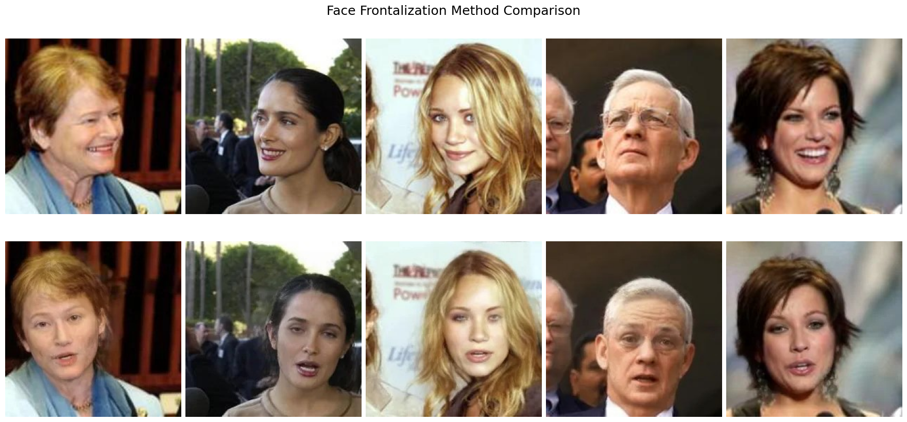
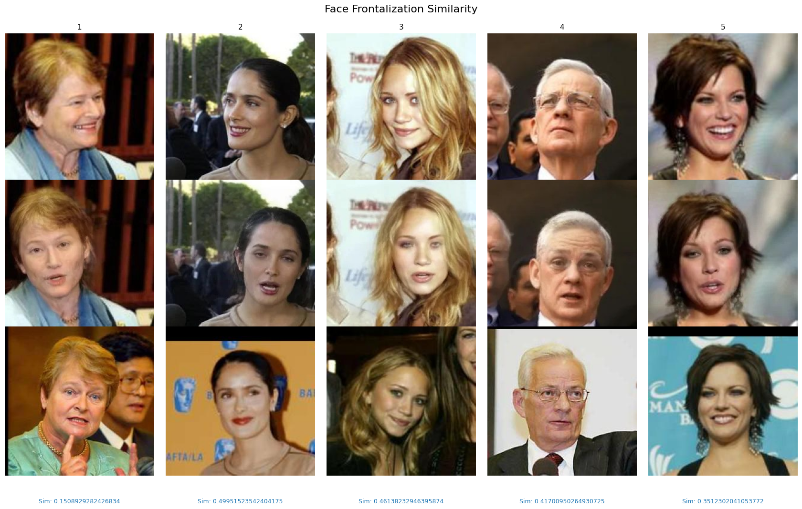
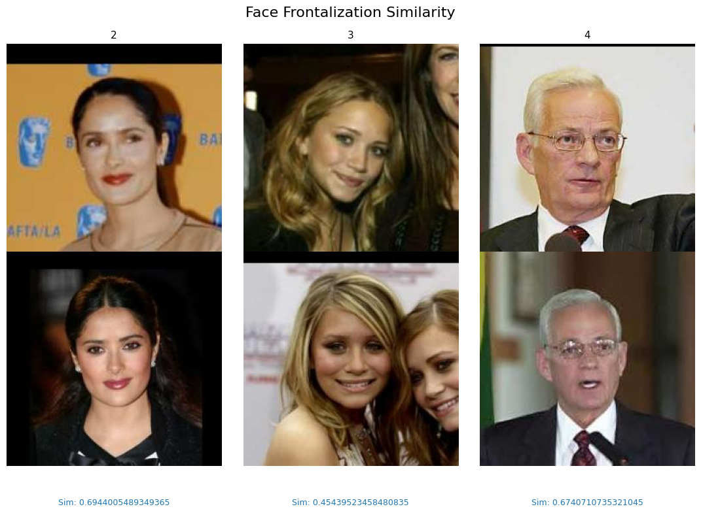

# Face Frontalization
**Project: Comparison of Face Frontalization Models / Face Frontalization-Related Tasks**

---

## 📌 Introduction
In this project, we implemented several **open-source models** for the **Frontalization** task (also known as Face Reenactment / Animation).  
We compared their outputs in terms of:

- Output quality  
- Model execution speed  
- Resource requirements  
- Installation complexity  
- Special features  

---

## 🔍 Reviewed Models
1. [**FacePoke**](https://github.com/jbilcke-hf/FacePoke) – Interactive tool for direct image manipulation, enabling head movement (based on LivePortrait).  
2. [**LivePortrait**](https://github.com/KwaiVGI/LivePortrait) – Efficient portrait animation model with **stitching** and **retarget control**.  
3. [**AniPortrait**](https://github.com/Zejun-Yang/AniPortrait/tree/main) – Voice-driven portrait animation with **face reenactment**.  
4. [**FSRT**](https://github.com/andrerochow/fsrt) – CVPR 2024 framework for face reenactment, considering **head-pose, emotions, and appearance**.  
5. [**scaleway/frontalization**](https://github.com/scaleway/frontalization) – GAN-based frontalization implementation with **NVIDIA DALI** for fast data processing.  
6. [**FFWM**](https://github.com/csyxwei/FFWM) – Flow-based warp model for frontalization with optical supervision (ECCV 2020).  

---

## 📊 Comparison Table

| Model            | Speed (FPS) | Output Quality | Installation Complexity | GPU/Resource Usage | Special Notes |
|------------------|-------------|----------------|-------------------------|--------------------|---------------|
| **FacePoke**     | –           | Interactive, LiveDemo | Docker / Local | Requires GPU       | Good for live interaction |
| **LivePortrait** | –           | Natural        | Conda + FFmpeg          | Medium             | Supports animals |
| **AniPortrait**  | –           | Audio-to-Image | CLI + Gradio            | Pretrained weights | Audio-driven |
| **FSRT**         | –           | Precise        | PyTorch + face-alignment| High               | Motion relative/absolute |
| **scaleway**     | –           | GAN            | PyTorch + DALI          | Medium             | Classic GAN implementation |
| **FFWM**         | –           | Warp-based     | PyTorch 1.5 + setup.sh  | Medium             | Good for uneven lighting |

> **Note:** Exact values (FPS, metrics such as SSIM/FID, etc.) should be added after real-world testing.

---

## 🖼️ Sample Outputs
  
  
  

---

## ⚙️ Setup & Run

### 1️⃣ FacePoke
```bash
# Requirements: Python 3.10 + CUDA 12.4 + Git LFS
git clone https://github.com/jbilcke-hf/FacePoke.git
cd FacePoke
pip3 install --upgrade -r requirements.txt
cd client
bun install
bun build ./src/index.tsx --outdir ../public/
cd ..
python app.py
# Browser: http://localhost:8080

# Run with Docker
docker build -t facepoke .
docker run -p 8080:8080 facepoke

# 


نکات

توسعه‌دهنده فقط روی Linux (Python 3.10 + CUDA 12.4) تست کرده است.

روی Apple Silicon برخی کاربران خطای «Failed to initialize face detection» گزارش داده‌اند.

نسخه‌ی دمو روی Hugging Face Space در دسترس است، اما برای عملکرد حرفه‌ای بهتر است محلی اجرا شود.
---
##  LivePortrait
```bash
نصب: conda create -n liveportrait python=3.8 + نصب dependencyها.

اجرا: اسکریپت demo برای تولید ویدیو.

ویژگی‌ها: سرعت بالا، پشتیبانی از حیوانات.
---
## AniPortrait


نصب: pip install -r requirements.txt

اجرا: CLI یا Gradio.

ویژگی‌ها: انیمیشن پرتره بر اساس صدا (Audio-Driven).
---
## FSRT
```bash

نصب: نیاز به PyTorch + face-alignment.

اجرا: اسکریپت‌های train و eval.

ویژگی‌ها: CVPR 2024، Transformer-based.
---
### scaleway/frontalization
```bash

نصب: PyTorch + NVIDIA DALI.

اجرا: اسکریپت‌های آموزش/ارزیابی موجود.

ویژگی‌ها: GAN برای frontalization.

### FFWM
```bash

نصب: bash setup.sh (PyTorch 1.5 توصیه می‌شود).

اجرا: اسکریپت training و evaluation.

ویژگی‌ها: warp-based frontalization.

نتایج

در این بخش تصاویر خروجی، جدول امتیازها و متریک‌ها (FID, SSIM, FPS و غیره) قرار داده خواهد شد.

نتیجه‌گیری

مدل‌های AniPortrait و LivePortrait برای کاربردهای تعاملی/سینماتیک مناسب‌تر هستند.

FSRT دقت بالایی در انتقال حالت‌ها دارد.

مدل‌های GAN مانند scaleway و FFWM در Frontalization کلاسیک عملکرد خوبی دارند.

FacePoke ابزاری ساده و تعاملی برای دمو و نمایش زنده است.

